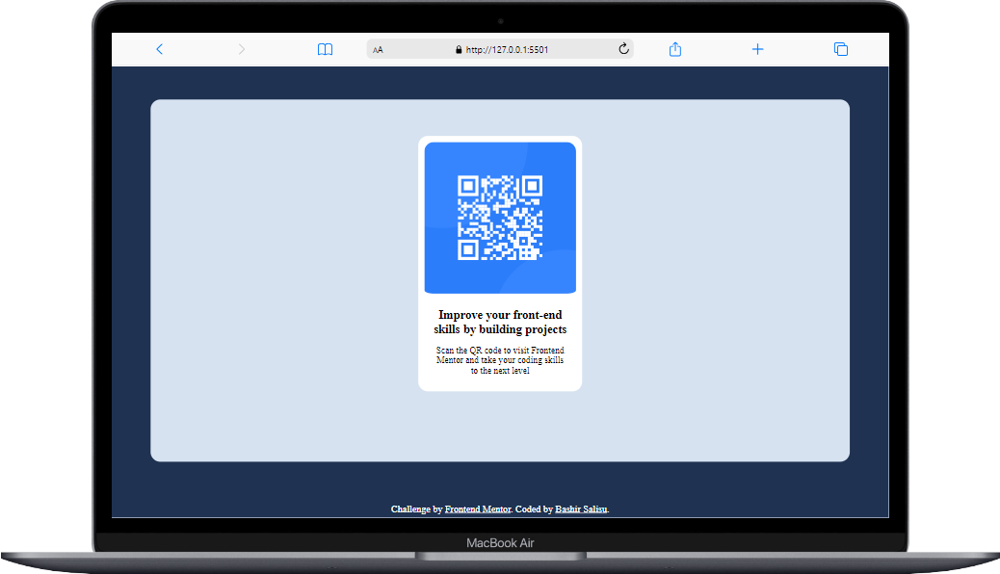
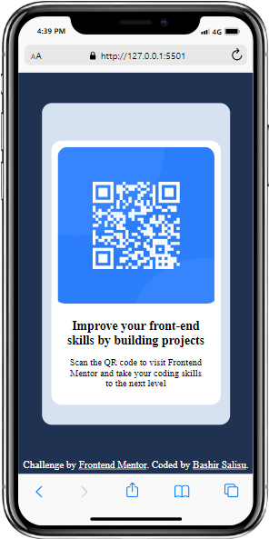

# Frontend Mentor - QR code component solution

This is a solution to the [QR code component challenge on Frontend Mentor](https://www.frontendmentor.io/challenges/qr-code-component-iux_sIO_H). Frontend Mentor challenges help you improve your coding skills by building realistic projects.

## Table of contents

- [Frontend Mentor - QR code component solution](#frontend-mentor---qr-code-component-solution)
  - [Table of contents](#table-of-contents)
  - [Overview](#overview)
    - [Screenshot](#screenshot)
    - [Links](#links)
  - [My process](#my-process)
    - [Built with](#built-with)
    - [What I learned](#what-i-learned)
    - [Continued development](#continued-development)
    - [Useful resources](#useful-resources)
  - [Author](#author)
  - [Acknowledgments](#acknowledgments)

## Overview

The challenge is to build out this QR code component and get it looking as close to the design as possible.

### Screenshot

### Links

- Solution URL: [Add solution URL here](https://your-solution-url.com)
- Live Site URL: [Add live site URL here](https://your-live-site-url.com)

## My process

I started with the markup layout for the design using HTML attributes for structure.

Created an external CSS file for styling the HTML and linked it with the index.html page

Styled the body and the attribute that needed to be styled and finally wrote the styles for mobile and desktop view to ensure that the content is responsive and meets WCAG requirements by testing the full range of screen sizes from 320px to large screens.

### Built with

- Semantic HTML5 markup
- CSS custom properties
- Flexbox
- Mobile-first workflow

### What I learned

I had fun while i was doing this challenge, it helped me become more confident in my skills that i am a preety good web developer.

### Continued development

I will still continue learning more about Responsive design because this challenge made me understand my lapses and areas i need to improve.

### Useful resources

## Author

- Frontend Mentor - [@Billions-tech](https://www.frontendmentor.io/profile/Billions-tech)
- Twitter - [@Tyson](https://www.twitter.com/Tyson)

## Acknowledgments

I just want to be grateful for where im at and the power of the internet and the amazing minds that created this challenge to make people become better front-end programmers, thank you frontendmentors
